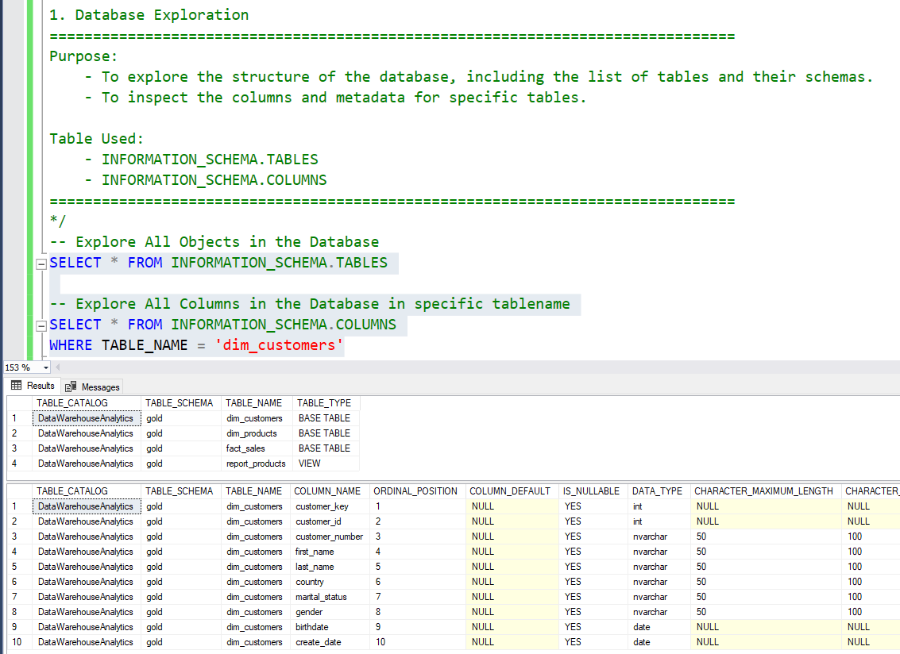
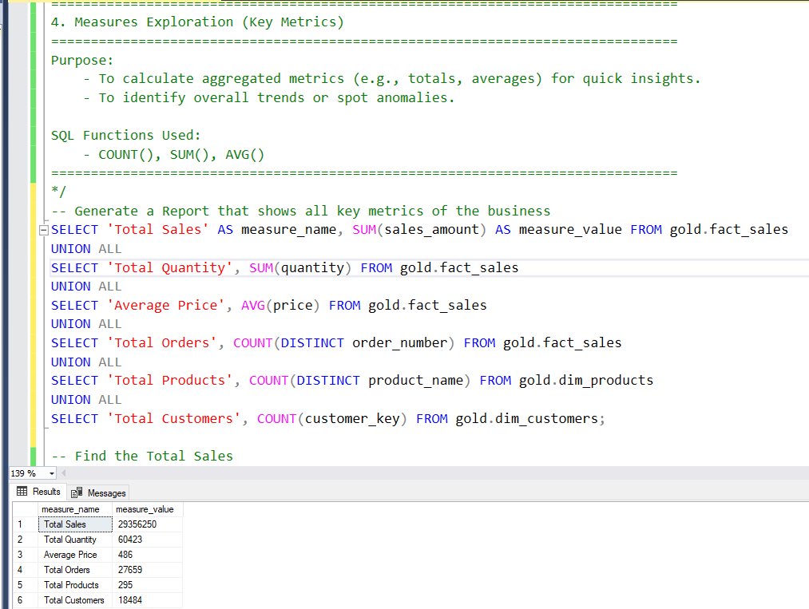
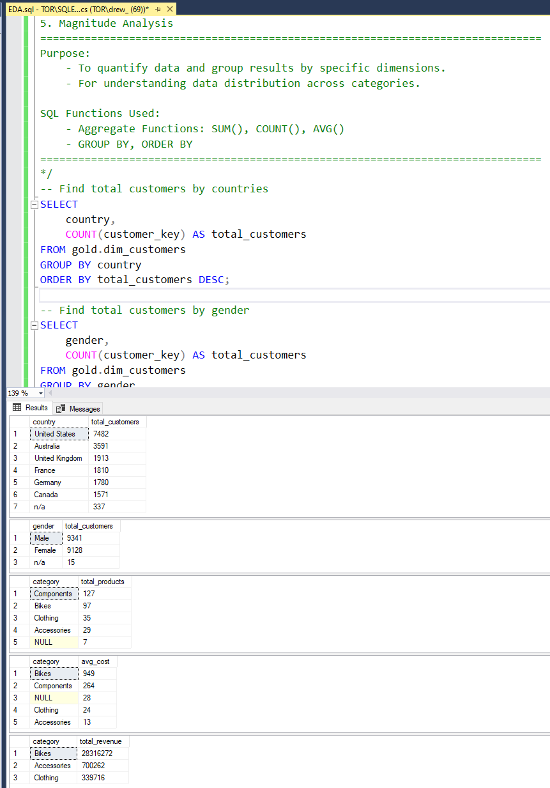

# SQL EDA (exploratory data analysis)

Special thanks to Baraa Khatib Salkini for the tutorial that guided the dashboard build.

---

## 📂 Repository Structure
```
SQL-exploratory-data-analysis/
│
├── datasets/                           # Raw datasets used for the course (csv)
│
├── docs/                               # questions and result
│
└── scripts/                            # queries for this EDA
```

## EDA 

## 1 Database Exploration



---
## 2 Dimension Exploration


---
## 3 Date Range Exploration


---
## 4 Measures Exploration



---
## 5 Magnitude Analysis



---
## 6 Ranking Analysis


---

## ☕ Stay Connected

Let's stay in touch! Feel free to connect with me on the following platforms:

[](https://www.linkedin.com/in/rowel-andrew-legaspi/)


